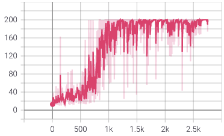
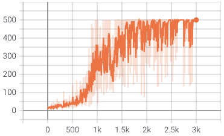

#### Simple tabular Q-learning with/without $\epsilon$-greedy exploration

```bash
python ./tabular_q.py [--exp greedy|eps|decay-eps] [--noslip False|True]
```

Related blog post: [Quick recap of basic exploration strategy in RL - epsilon-greedy](http://takashinagata.com/2020/04/09/Quick_Recap_of_eps_reedy.html)

---

#### Policy gradient (CartPole)

```bash
python policy_gradient.py
```
##### Results
###### CartPole-v0

###### CartPole-v1


---

#### Cross entropy method on Pendulum-v0

```bash
# training
python ./cem_pendulum.py

# test
python ./cem_pendulum.py --test True --model_path ./models/saved_models/CEM-Pendulum-v0.pt --epochs 10
```
